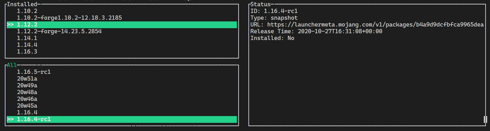

# [WIP] MinecheRUster (Manchester)

A basic Minecraft Launcher with Terminal UI, written in RUst, based on Tokio (Tokyo).

## Preview

## TODO

- [x] TUI
- [x] Read versions
- [ ] Download
- [ ] Generate startup args
- [ ] User login
- [ ] Mod

## WTF

You may find the name composed by Minecraft + Launcher + Rust -> MinecheRUst -> Manchester with RU based on Tokyo. Here is a WTF T-shirt showing Manchester, Moscow (RUssia) and Tokyo:

